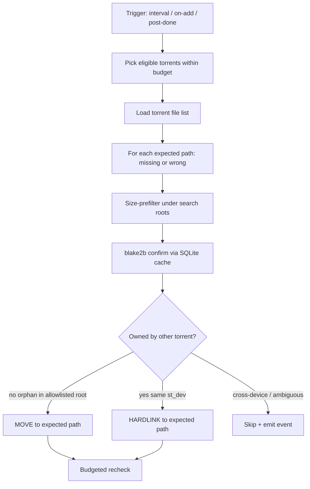

# feat: Automatic content-hash file placement

## Summary

Replace manual MatchingPanel hardlink discovery with an automatic matcher that finds equivalent on-disk content by **full-file content hash**, then **moves** orphan matches into the torrent’s expected path or **hardlinks** when the same bytes already belong to another torrent. Size-based `renameFile` rematch stays available as a manual/CLI tool only.

## Problem Frame

Today’s “Hardlinks” UI does not create hardlinks at expected paths — it size/inode-scans and still applies via `renameFile`. Users with large libraries need silent placement: if the bytes already exist under category/download roots, put them where this torrent expects them (move if orphaned; hardlink if owned elsewhere). Manual buttons are the wrong interface.

## Requirements

- R1. Remove MatchingPanel hardlink button(s) and stop advertising hardlink discovery as a user action.
- R2. Equivalence uses full-file content hashes (not size-alone for auto placement).
- R3. Search category/default download roots and configured matcher folders for candidates.
- R4. If a matching file does **not** belong to another torrent → **MOVE** it to this torrent’s expected path (within allowlisted roots).
- R5. If a matching file **belongs** to another torrent → **HARDLINK** at the expected path (same filesystem only).
- R6. After successful placement, trigger qBittorrent recheck for that torrent (budgeted).
- R7. Automatic triggers: matcher enabled + interval (like duplicates), on torrent add when files are known, optional after debrid completion.
- R8. Must not block the interceptor sync loop; must stay safe at ~8k torrents / multi-TB scale.
- R9. Manual size rematch (`qbx match`, MatchingPanel scan/apply) remains unchanged and is never auto-run beside placement.

## Assumptions

- Locked from scoping: full-file hash; ownership via qBT file membership; run on add + periodic (+ optional post-debrid).
- Orphan MOVE only from allowlisted search/staging roots (matcher folders + category download paths) — not from arbitrary library trees outside those roots.
- Cross-device hardlink/move defaults to **skip + event** (no silent multi-TB copy).
- External Tavily research was requested but unavailable (plan limit); grounding uses feasibility review, cross-seed/qui hardlink prior art, and local codebase.

## Key Technical Decisions

- KTD1. **Place-at-expected-path, not auto-`renameFile`.** Auto pipeline never calls `renameFile`. Manual size rematch keeps rename semantics.
- KTD2. **Hash = `hashlib.blake2b` (stdlib)** over full file contents; cache by `(path, size, mtime_ns)` in a SQLite index under the config dir. No new dependency.
- KTD3. **Pipeline order:** size prefilter → hash confirm → ownership classify → move/link/skip → recheck. Never hash the whole tree first.
- KTD4. **Ownership:** a candidate is owned if its resolved path is a file entry under another torrent’s `save_path`/`content_path` (boundary-aware). Warm from sync metadata; call `torrents/files` lazily for candidates only — never full 8k×files each pass.
- KTD5. **Orphan MOVE** only when candidate path is under configured search roots; otherwise hardlink or skip.
- KTD6. **Same `st_dev` required** for hardlink and for MOVE (skip on `EXDEV` unless a future opt-in copy flag).
- KTD7. **Scheduler** mirrors duplicates inside the interceptor (interval + on-add), non-blocking background task with per-pass budgets (max torrents, max hash bytes, max rechecks).
- KTD8. **Skip states:** `_inflight` / `qbx-debrid`, `checking*`, `moving`, `allocating`, `metaDL`, and incomplete torrents with `dlspeed > 0`.
- KTD9. **Ambiguous matches** (multiple same size+hash): prefer already-owned source with highest `nlink`; if still ambiguous → skip + event.
- KTD10. Retire public hardlinks UX; internalize or replace `POST /api/matcher/hardlinks` with a placement preview/debug endpoint (optional, auth-guarded).

## Scope Boundaries

### In scope

- Auto content-hash placement engine + hash index + ownership helper
- Interceptor wiring (interval / on-add / optional post-done)
- MatcherConfig extensions (budgets, roots, enable auto placement)
- Remove Hardlinks button; update README/AGENTS as needed
- Tests for move vs hardlink, EXDEV, active-DL skip, ownership, budgets

### Out of scope

- Cross-seed torrent injection (cross-seed/qui territory)
- Changing debrid delivery / webseed injection
- Auto-running size+`renameFile` rematch
- Cross-device copy fallback (deferred behind opt-in)

### Deferred to Follow-Up Work

- Optional BLAKE3 native dependency for speed
- Optional cross-device copy for orphans
- UI status column for placement outcomes
- Knowledgebase entry via `/ce-compound` after ship

## High-Level Technical Design

## Implementation Units

### U1. Content hash index (SQLite)

**Goal:** Durable `(path, size, mtime) → blake2b` cache with invalidate-on-stat-mismatch.

**Requirements:** R2, R8

**Dependencies:** none

**Files:**
- `qbx/engine/hash_index.py` (create)
- `tests/test_hash_index.py` (create)

**Approach:** Store under `$QBX_CONFIG_DIR/file-hashes.sqlite`. Stream hash in chunks. API: `digest_for(path) -> str`, `invalidate(path)`, optional size inverted lookup helper.

**Test scenarios:**
- Happy: hash file, second call hits cache when mtime/size unchanged
- Edge: touch mtime → rehash
- Error: missing path returns clear error / None without corrupting DB

**Verification:** unit tests pass; no dependency on qBT.

### U2. Disk size index over search roots

**Goal:** Incremental scan of matcher folders + category/save roots into a size→paths map without re-walking everything every pass when possible.

**Requirements:** R3, R8

**Dependencies:** none

**Files:**
- `qbx/engine/disk_index.py` (create) or extend `qbx/engine/matcher.py`
- `tests/test_disk_index.py` (create)

**Approach:** Reuse `scan_directory` patterns; add optional mtime watermark per root. Cap walk time/files per pass.

**Test scenarios:**
- Happy: two files same size indexed together
- Edge: empty root / missing root
- Integration: respect require_same_extension only at match time, not at index time

**Verification:** tests cover indexing + skip non-files.

### U3. Ownership registry (lazy)

**Goal:** Classify a candidate path as owned-by-other-torrent vs orphan.

**Requirements:** R4, R5, R8

**Dependencies:** none

**Files:**
- `qbx/engine/ownership.py` (create)
- `tests/test_ownership.py` (create)

**Approach:** From sync/torrent list, keep `save_path`/`content_path` prefixes. For candidates under a prefix, confirm via `files` API when needed. Boundary-aware path checks (`/data` vs `/data2`).

**Execution note:** Characterization-first around path-boundary collisions.

**Test scenarios:**
- Happy: file under other torrent save_path + in file list → owned
- Happy: file under search root but not in any torrent → orphan
- Edge: prefix collision false positive prevented
- Error: files API failure → treat as unknown → skip (not move)

**Verification:** unit tests with fake torrent maps; no live qBT required.

### U4. Placement plan + apply

**Goal:** For one torrent, produce and apply move/hardlink/skip decisions at expected paths.

**Requirements:** R2–R6, R9

**Dependencies:** U1, U2, U3

**Files:**
- `qbx/engine/placement.py` (create)
- `qbx/engine/matcher.py` (modify only if shared helpers)
- `tests/test_placement.py` (create)

**Approach:** Expected path = `save_path / torrent_file_name`. Never `renameFile`. Dest exists with same inode → no-op success. Dest exists wrong content → skip. Emit structured events (`placement.move`, `placement.hardlink`, `placement.skip`).

**Test scenarios:**
- Happy: orphan → moved into expected path
- Happy: owned same-dev → hardlinked; source unchanged
- Edge: EXDEV → skip event
- Edge: active incomplete with dlspeed → not planned
- Edge: ambiguous multi-hash → skip
- Integration: apply does not call `renameFile`
- Error: permission denied → skip without crashing pass

**Verification:** tmp_path filesystem tests; mock qBT recheck call counted ≤ budget.

### U5. Matcher scheduler in interceptor

**Goal:** Wire auto placement like duplicates: `matcher.enabled`, `interval_minutes`, on-add, optional post-`TAG_DONE`.

**Requirements:** R7, R8

**Dependencies:** U4

**Files:**
- `qbx/engine/interceptor.py` (modify)
- `qbx/config.py` (extend `MatcherConfig`)
- `tests/test_interceptor_matcher.py` or extend existing interceptor tests (create/modify)

**Approach:** Background task / gated section in `_run`; never block sync. Budgets on MatcherConfig. On-add waits until file list exists. Thread `event_batch_id` when invoked from sync/policy (see solutions learning on event batches).

**Test scenarios:**
- Happy: enabled interval triggers placement for eligible torrent
- Happy: disabled matcher does nothing
- Edge: on-add before files ready → deferred
- Integration: sync loop continues if placement raises

**Verification:** focused async tests with stubbed placement.

### U6. Remove hardlink UI / retire public hardlinks surface

**Goal:** Delete Hardlinks button and related UX; stop implying discovery-as-action.

**Requirements:** R1, R10

**Dependencies:** U4 (so replacement exists or is clearly “automatic only”)

**Files:**
- `qbx/web/matcher/src/components/MatchingPanel.tsx` (modify)
- `qbx/web/matcher/src/api/backend.ts` (modify)
- `qbx/server.py` (modify — remove or internalize `/api/matcher/hardlinks`)
- `README.md` / `AGENTS.md` (modify as needed)

**Approach:** Remove button + `FindHardlinks` client usage. Prefer deleting the public route; if a debug preview is needed, gate it and rename to placement semantics.

**Test expectation:** none for pure UI removal beyond build; server test if route removed (404 or new contract).

**Verification:** frontend builds; no Hardlinks control in MatchingPanel.

### U7. Config + docs for operators

**Goal:** Document auto placement knobs and precedence with existing matcher settings.

**Requirements:** R3, R4, R7, R8

**Dependencies:** U5

**Files:**
- `qbx/config.py` (MatcherConfig fields)
- `packaging/config.provisional.yaml` (modify)
- `README.md` (modify)

**Approach:** Fields such as `auto_placement`, `search_folders`, `max_hash_bytes_per_pass`, `max_rechecks_per_pass`, `allow_cross_device_copy` (default false). Keep `matcher.enabled` as master switch and actually wire it (today unused).

**Test scenarios:**
- Happy: defaults keep auto placement off or conservative until enabled
- Edge: empty folders → only torrent save_path / category paths

**Verification:** config unit assertions; README describes move vs hardlink policy.

## Risks & Dependencies

| Risk | Mitigation |
|------|------------|
| Multi-TB full hashing | Size prefilter + cache + per-pass byte budget |
| 8k× `files` API storm | Lazy ownership; prefix warm from sync |
| Orphan MOVE deletes *arr library data | Allowlist roots only; unknown → skip |
| Cross-device fill disk | Default skip EXDEV |
| Fight with debrid downloads | Skip inflight/active/checking |
| Confuse with renameFile rematch | Hard split: auto never renames |

**Dependencies:** qBittorrent WebAPI `files`, `renameFile` (manual only), `recheck`, `categories`; writable download filesystem with hardlink support.

## Open Questions

- OQ1. Default `matcher.enabled` / `auto_placement` on first upgrade — recommend **off** until operators set search folders (safer). Confirm at implementation if product wants on-by-default.
- OQ2. Whether post-debrid trigger is required in v1 or can wait (plan includes as optional hook).

## Sources & Research

- Local: `qbx/engine/matcher.py`, `qbx/engine/interceptor.py` (duplicates interval + `hardlink_dir` mirror), `MatchingPanel.tsx`, `tests/test_matcher.py`
- Feasibility: GO-WITH-CONDITIONS (scale budgets, place-at-expected, orphan allowlist, EXDEV skip)
- Institutional: `docs/solutions/integration-issues/qbittorrent-event-batches-drive-full-policy-passes.md` (batch IDs if touching policy)
- External prior art: cross-seed / qui hardlink mode (link at expected layout; same-filesystem constraint) — Tavily research unavailable (quota)
