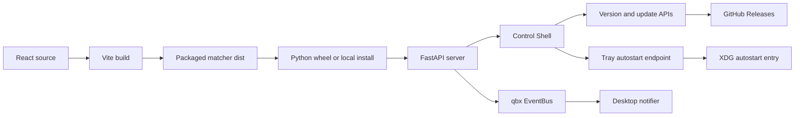
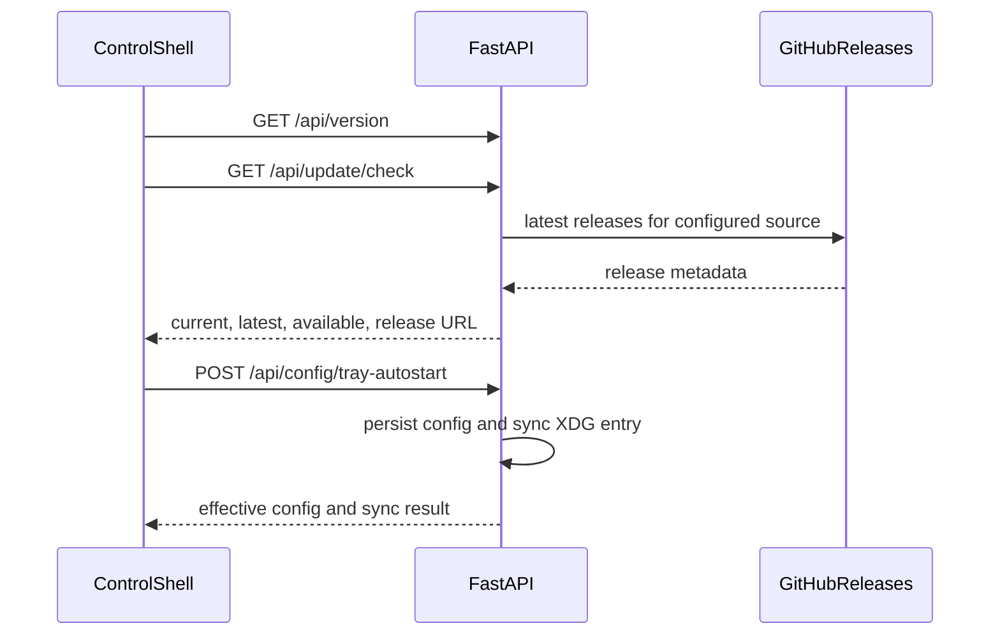

# feat: Reliable Control Shell and desktop lifecycle

## Summary

Make the Control Shell a required packaged artifact and extend qbx's desktop integration with check-only GitHub updates, version reporting, selected desktop notifications, and persistent XDG tray autostart.

---

## Problem Frame

Local installs can run a daemon whose imported package has no `qbx/web/matcher/dist`, producing a 503 despite a successful Python install. The desktop shell also lacks the lifecycle conveniences already proven in ThirdFlare One: visible version/update state, meaningful native notifications, and a user-controlled tray login start.

## Requirements

- R1. `install.sh`, `scripts/install-local.sh`, wheels, and sdists must fail rather than install without a built Control Shell.
- R2. Runtime shell resolution must use assets shipped beside the imported `qbx` package.
- R3. The API must expose one authoritative qbx version and a check-only update result for the configured stable/beta GitHub source.
- R4. Settings must persist update channel, startup-check, desktop-notification, and tray-autostart choices.
- R5. Tray autostart changes must create/remove an XDG autostart entry without enabling a second daemon service.
- R6. Desktop notifications must be allowlisted, non-blocking, and silent on unsupported/headless hosts.
- R7. The Control Shell must show current version, update status, and the new desktop controls.

## Key Technical Decisions

- KTD1. Build the Vite shell before Python packaging and explicitly include `qbx/web/matcher/dist` in wheel/sdist artifacts; do not attempt runtime npm builds.
- KTD2. Use `qbx.__version__` as the runtime version source and keep project metadata aligned.
- KTD3. Updates are check-only for source/local-venv installs. No executable replacement, package-manager elevation, or AppImage apply is included.
- KTD4. Query GitHub Releases through `httpx`, compare normalized semantic versions, and return a guided local reinstall command plus the release URL.
- KTD5. Persist tray autostart through a dedicated endpoint because it has an OS side effect; normal config saves remain data-only.
- KTD6. Emit desktop notifications from the daemon through an EventBus listener for a narrow event-kind allowlist; `notify-send` is invoked without a shell.

## High-Level Technical Design

## Implementation Units

### U1. Enforce and package the Control Shell build

**Goal:** Ensure every install artifact contains a fresh `dist/index.html` and assets.

**Requirements:** R1, R2

**Dependencies:** None

**Files:** `install.sh`, `scripts/install-local.sh`, `pyproject.toml`, `.gitignore`, `qbx/web/matcher/dist/`, `tests/test_packaging.py`

**Approach:** Build with `npm ci` when the lockfile exists, verify `dist/index.html`, then install/package. Configure Hatch include rules so ignored generated assets are retained. Add an artifact test that builds a wheel and inspects its archive.

**Patterns to follow:** Multi-stage frontend build in `Dockerfile`; runtime asset lookup in `qbx/server.py`.

**Test scenarios:**
1. A built wheel contains `qbx/web/matcher/dist/index.html` and hashed assets.
2. Installer exits non-zero when npm is unavailable and no prebuilt shell exists.
3. Local installer rebuilds stale/missing output before pip installation.

**Verification:** A clean install serves `/` with HTML and does not return the build-instruction 503.

### U2. Add version and check-only update services

**Goal:** Expose consistent version metadata and safe GitHub release checks.

**Requirements:** R3

**Dependencies:** U1

**Files:** `qbx/__init__.py`, `qbx/config.py`, `qbx/update.py`, `qbx/server.py`, `pyproject.toml`, `config/update-manifest.json`, `tests/test_update.py`, `tests/test_server.py`

**Approach:** Add typed update settings with the upstream repository default, normalize tags before comparison, ignore drafts, select prereleases only for beta, and map network/rate-limit failures to a structured non-500 result.

**Test scenarios:**
1. Stable channel ignores prereleases and reports a newer stable release.
2. Beta channel accepts a prerelease.
3. Equal/current-newer versions report no update.
4. Invalid source and upstream timeout return actionable errors without crashing the API.
5. `/api/version`, `/api/health`, and FastAPI metadata expose the same version.

**Verification:** API consumers can distinguish available, current, downgrade, and unavailable-check states.

### U3. Add desktop notification and tray autostart services

**Goal:** Provide opt-in login startup and meaningful native notifications.

**Requirements:** R4, R5, R6

**Dependencies:** U2

**Files:** `qbx/config.py`, `qbx/desktop.py`, `qbx/events.py`, `qbx/server.py`, `packaging/qbx-tray.desktop`, `scripts/install-local.sh`, `tests/test_desktop.py`, `tests/test_events.py`, `tests/test_server.py`

**Approach:** Add EventBus listeners, notify only selected success/failure transitions, and synchronize `~/.config/autostart/qbx-tray.desktop` through a dedicated authenticated endpoint. Reconcile desired autostart state during daemon startup.

**Test scenarios:**
1. Enabling autostart writes an entry with the installed absolute tray executable.
2. Disabling autostart removes only qbx's entry; repeated calls are idempotent.
3. Non-Linux or unresolved launcher returns a structured skipped result.
4. Allowlisted events invoke `notify-send` once; noisy/unlisted events do not.
5. Missing `notify-send` and disabled notifications are silent no-ops.

**Verification:** Login autostart follows saved state and desktop notifications cannot block event producers.

### U4. Extend the Control Shell settings experience

**Goal:** Surface version, updates, startup checks, notifications, and tray autostart in the existing settings composition.

**Requirements:** R4, R7

**Dependencies:** U2, U3

**Files:** `qbx/web/matcher/src/api/backend.ts`, `qbx/web/matcher/src/components/SettingsPanel.tsx`, `qbx/web/matcher/src/App.tsx`

**Approach:** Add an application section to Settings, use the existing API client/toast patterns, check once on shell startup when configured, and link to GitHub rather than applying binaries.

**Test scenarios:**
1. Opening settings loads current version and persisted desktop/update values.
2. Manual check shows up-to-date, update-available, and network-error states.
3. Startup check runs once and only toasts when an update is available or checking fails.
4. Tray autostart toggle reflects the dedicated endpoint result and rolls back on failure.

**Verification:** Users can manage desktop lifecycle and understand update state without leaving the Control Shell.

### U5. Document and validate the integrated install

**Goal:** Keep operator guidance aligned with the actual desktop/update behavior.

**Requirements:** R1-R7

**Dependencies:** U1-U4

**Files:** `README.md`, `AGENTS.md`, `packaging/config.provisional.yaml`

**Approach:** Document build prerequisites, check-only update behavior, notification requirements, and XDG tray autostart.

**Test scenarios:** Test expectation: none -- documentation-only unit; behavioral coverage belongs to U1-U4.

**Verification:** A new KDE user can install, open the shell, enable autostart, and check for updates from documented steps.

## Scope Boundaries

### In Scope

- Local/venv and Python package asset reliability
- Stable/beta GitHub release checks
- Desktop notifications and XDG tray autostart
- Control Shell settings and startup update notification

### Deferred to Follow-Up Work

- AppImage/deb/rpm/Flatpak/Snap packaging pipelines
- In-app executable replacement or privileged package-manager actions
- Fork discovery and arbitrary repository browsing
- Non-Linux notification backends

## Risks and Dependencies

- GitHub unauthenticated rate limits can make update checks unavailable; failures remain visible and non-fatal.
- Generated frontend assets increase source/wheel size; package tests enforce their presence.
- Event streams are high volume; the notifier allowlist prevents notification floods.
- XDG autostart and systemd user service can overlap; the tray entry starts/reuses the daemon and the plan does not enable the service automatically.

## Sources and Research

- ThirdFlare One patterns: `lib/update/`, `lib/notify/`, `lib/tray/autostart.mjs`, `docs/UPDATES.md`, and `public/app.js`.
- qbx patterns: `Dockerfile`, `qbx/server.py`, `qbx/config.py`, `scripts/install-local.sh`, and `qbx/web/matcher/src/components/SettingsPanel.tsx`.
