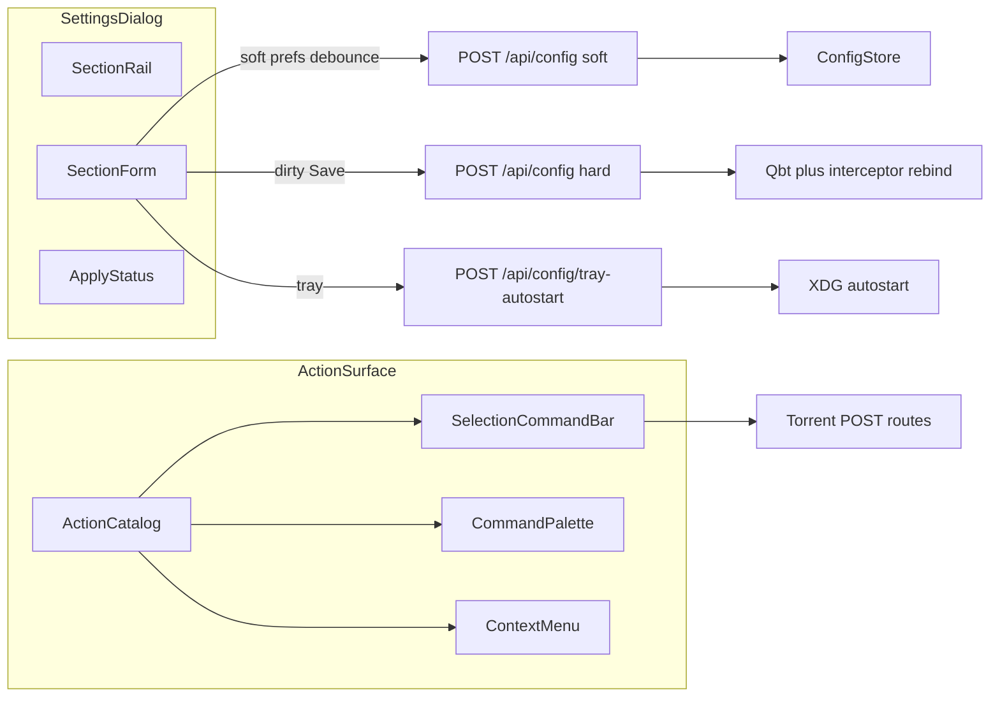
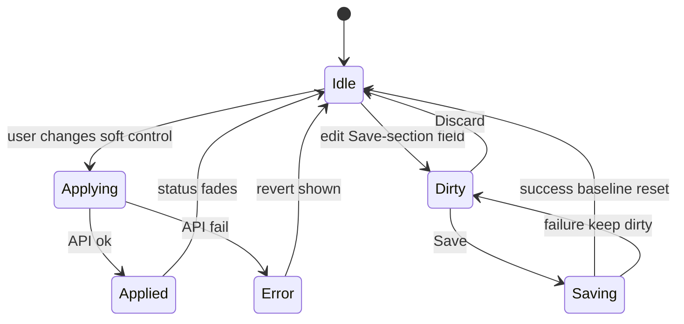

# feat: Power-user Settings and action command surface

## Summary

Rebuild Control Shell Settings as a focused, section-railed dialog with an unambiguous apply model, expose the ops-critical config surface, and replace scattered Force/Nudge/Retry buttons with a selected-torrent command bar plus a ⌘K command palette—so every control is obviously tied to its function and applied state is never ambiguous.

---

## Problem Frame

Settings today is a push-down form under the header that mixes immediate tray toggles with deferred Save, buries Application prefs under providers, and exposes only a fraction of `AppConfig`. Torrent actions (Force debrid, Nudge, Retry, Skip) are duplicated across Overview, Debrid, and the context menu with weak labels and little feedback—power users cannot tell what ran, whether it is still available, or why a control is disabled.

## Requirements

- R1. Settings is a dedicated focused surface (dialog/drawer), not a push-down that compresses the grid.
- R2. Every control has an explicit apply contract: either applies immediately with visible status, or belongs to a Save section with dirty/Discard/Save—never mixed silently in one section.
- R3. Ops-critical config is editable in the UI: Connection (qbt + server token), Providers, Anonymity, Interceptor, Matcher, Application (updates + desktop).
- R4. Secrets keep redacted round-trip; Save sections only send dirty fields.
- R5. Selected-torrent actions live in one dense command bar with clear enablement reasons and run feedback.
- R6. A ⌘K / Ctrl+K command palette exposes the same actions plus daemon/nav commands.
- R7. Overview stops duplicating the full Debrid action row; context menu keeps a thin set of actions.
- R8. Config writes that only flip soft prefs must not tear down qBittorrent/interceptor when unnecessary.

## Assumptions

- Design system stays React + existing shadcn/ui + zinc/sky tokens (Module C). CrowdStrike Foundry/Shoelace does not apply.
- Automation, duplicates, and quality sections are deferred; the Settings shell must make adding them later straightforward.
- Hybrid apply (immediate soft prefs + Save for credentials/connectivity) is the ambiguity fix—not pure autosave of secrets.

## Key Technical Decisions

- KTD1. **Settings = Dialog with sticky section rail** (Connection · Providers · Anonymity · Interceptor · Matcher · Application). Cardless section rows; reuse `dialog`, add shadcn `command` (+ tabs/switch if needed).
- KTD2. **Section-level apply contracts, labeled in the UI:**
  - Immediate: Application toggles (notifications, check-on-startup, channel), tray autostart (existing endpoint), non-secret interceptor/matcher booleans and numeric knobs after debounce.
  - Save: qBittorrent URL/user/password, API token, proxy URL/credentials, provider keys/enable/priority.
  - Each immediate control shows idle → Applying… → Applied / Error+revert. Save sections show Unsaved changes · Discard · Save (Save disabled when clean).
- KTD3. **Shared action catalog** (`actions.ts` or similar): id, label, group, shortcut, `when(selection, health)`, `run`. Overview/Debrid/context menu/command bar/palette all consume it—no parallel TipButton copies.
- KTD4. **Command bar** under the header (or above the workspace) when a torrent is selected: primary ops in order Force debrid · Nudge · Retry · Skip/Allow · Recheck · Pause/Resume. Disabled buttons show tooltip reason.
- KTD5. **Command palette** for power users: Daemon, Torrent (context-first when selected), Nav, Settings jump-to-section.
- KTD6. **Smarter `POST /api/config`**: classify patch keys; soft prefs update store + notifier/tray without full qbt/interceptor rebind; connectivity/provider/interceptor structural changes keep today’s rebind.

## High-Level Technical Design

## Implementation Units

### U1. Action catalog and selection command bar

**Goal:** One source of truth for torrent/daemon actions; usable power-user bar.

**Requirements:** R5, R6, R7

**Dependencies:** None

**Files:** `qbx/web/matcher/src/lib/actions.ts` (new), `qbx/web/matcher/src/components/CommandBar.tsx` (new), `qbx/web/matcher/src/App.tsx`, `qbx/web/matcher/src/components/OverviewPanel.tsx`, `qbx/web/matcher/src/components/DebridPanel.tsx`, `qbx/web/matcher/src/components/TorrentContextMenu.tsx`

**Approach:** Define catalog entries for Force debrid, Nudge, Retry, Skip/Allow auto, Recheck, Pause/Resume, Open WebUI, Scan now, Interceptor start/stop. Command bar renders primary torrent ops when `selected` is set; buttons show busy state and toast/log on completion. Strip duplicate rows from Overview; keep Debrid for pipeline/webseeds/tags only (plus catalog-driven secondary if needed). Context menu imports the same catalog subset.

**Patterns to follow:** Existing `run()` + `ControlApi` handlers; tooltip disable reasons like Debrid’s skip-tag check.

**Test scenarios:**
1. With a selected torrent, Force debrid invokes `intercept` once and shows busy then success/error.
2. When no selection, command bar hides or disables torrent actions with reason “Select a torrent”.
3. Skip auto disables when tag present; Allow auto appears instead and removes the tag.
4. Overview no longer renders Force/Nudge/Retry/Skip/Recheck duplicates.

**Verification:** Power user can run the main ops from the bar without opening Debrid; menu and bar stay in sync.

### U2. Command palette (⌘K)

**Goal:** Discoverable, keyboard-first access to the same catalog plus nav/settings.

**Requirements:** R6

**Dependencies:** U1

**Files:** `qbx/web/matcher/src/components/CommandPalette.tsx` (new), `qbx/web/matcher/src/components/ui/command.tsx` (add via shadcn), `qbx/web/matcher/src/App.tsx`, `qbx/web/matcher/package.json`

**Approach:** Add shadcn Command dialog. Groups: Daemon, Torrent (promoted when selected), Nav, Settings (jump opens Settings to section). Header keeps at most Interceptor + Settings + ⌘K affordance; demote Scan/Open WebUI into palette (and keep Open WebUI in catalog for menu).

**Test scenarios:**
1. ⌘K / Ctrl+K opens palette; Escape closes.
2. Typing “nudge” filters to Nudge; Enter runs when a torrent is selected.
3. Settings jump opens dialog on the named section.
4. Actions gated by `when` do not run and show as disabled or filtered.

**Verification:** Power user can drive daemon and torrent ops without hunting header buttons.

### U3. Settings dialog shell + apply status model

**Goal:** Focused Settings surface with unmistakable applied/dirty state.

**Requirements:** R1, R2

**Dependencies:** None (can parallel U1)

**Files:** `qbx/web/matcher/src/components/SettingsPanel.tsx` (rewrite), `qbx/web/matcher/src/App.tsx`, `qbx/web/matcher/src/components/ui/dialog.tsx`

**Approach:** Move Settings into Dialog. Left rail + scrollable sections. Introduce `baseline` + `dirty` for Save sections; immediate controls call apply helpers with per-row status. Close with dirty Save-section confirms discard. Do not auto-close on Save. Lead copy describes sections, not config precedence jargon (move precedence to a small Advanced note).

**Visual thesis:** Dense ops console; existing zinc/sky tokens; section rail + field rows; no decorative card soup.

**Test scenarios:**
1. Opening Settings does not collapse the grid into a push-down strip.
2. Editing API token enables Save; Discard restores baseline.
3. Closing with dirty Save fields prompts confirm; Escape follows the same rule.
4. Toggling desktop notifications shows Applying… then Applied without requiring Save.
5. Tray autostart failure reverts the control and shows Error.

**Verification:** User can always answer “is this applied?” from the control or the Save bar.

### U4. Soft vs hard config apply on the server

**Goal:** Immediate prefs without tearing down the daemon stack.

**Requirements:** R8, R2

**Dependencies:** U3

**Files:** `qbx/server.py`, `qbx/config.py`, `tests/test_server.py`, `tests/test_config.py`

**Approach:** Split update path: soft keys (`desktop.*`, `updates.check_on_startup`, `updates.channel`, safe matcher/interceptor scalars/bools) persist + reconfigure notifier; hard keys (`qbt`, `server.api_token`, `providers`, `anonymity`, structural interceptor) keep full rebind. Document the classification next to the handler. Tray remains on its dedicated endpoint.

**Test scenarios:**
1. PATCH desktop.notifications alone does not stop/start interceptor.
2. PATCH qbt.url still rebinds QbtClient and restarts interceptor when enabled.
3. REDACTED secret placeholders still preserve existing secrets on soft/hard paths.
4. Invalid tray autostart still refuses to persist.

**Verification:** Flipping notifications feels instant; changing qBittorrent URL still safely rebinds.

### U5. Ops-critical Settings sections

**Goal:** Expose Interceptor and Matcher (plus existing Connection/Providers/Anonymity/Application) with correct apply contracts.

**Requirements:** R3, R4

**Dependencies:** U3, U4

**Files:** `qbx/web/matcher/src/components/SettingsPanel.tsx`, `qbx/web/matcher/src/api/backend.ts`, `packaging/config.provisional.yaml` (comments only if needed), `docs/CONFIGURATION.md`, `website/configuration/index.md`

**Approach:**
- Save sections: Connection (qbt + token + verify_tls), Providers, Anonymity (proxy URL + related).
- Immediate (debounced): Interceptor stall/queue/delivery/metadata toggles and numeric fields; Matcher enable/auto_placement/folders (folders as comma or list editor), Application non-secret prefs.
- Keep delivery_mode with Interceptor; migrate from old qBittorrent-only placement if needed for clarity.
- Validate numbers (min/max) inline before apply.

**Test scenarios:**
1. Enabling matcher.auto_placement without folders shows inline validation and does not apply.
2. Changing stalled_min_minutes debounces then persists; interceptor keeps running (soft path).
3. Saving a new AllDebrid key rebinds debrid and preserves other providers.
4. Loading Settings shows redacted secrets as unchanged placeholders.

**Verification:** Power users can tune stall policy and matcher without editing TOML.

### U6. Polish header health + docs touch

**Goal:** Truthful header status so the shell does not look broken while Settings/actions improve.

**Requirements:** supports R1 clarity

**Dependencies:** None

**Files:** `qbx/web/matcher/src/App.tsx`, `docs/GETTING_STARTED.md` or website guides (short note on ⌘K / Settings)

**Approach:** Loading / online / offline / partial badges (from prior design-lens). Document command palette shortcut.

**Test expectation:** none -- presentational + docs; covered by manual verification.

**Verification:** Cold load never shows red “…” for loading.

## Scope Boundaries

### In Scope

- Settings dialog, apply model, ops-critical sections
- Action catalog, command bar, command palette
- Soft/hard config apply split
- Header health clarity

### Deferred to Follow-Up Work

- Automation / duplicates / quality Settings sections
- In-shell first-run setup wizard (ConnectionPanel revival)
- Full visual brand overhaul (new fonts/gradients)
- Mobile responsive layout

### Outside this product's identity

- CrowdStrike Foundry / Shoelace patterns (wrong design system for this app)

## Risks and Dependencies

- Soft/hard key classification must stay conservative: wrong soft-path for `providers` would skip rebind and confuse users—default unknown keys to hard.
- Debounced immediate apply can race; serialize applies per section or cancel in-flight on newer edits.
- Adding `command` dependency must stay compatible with current Vite/React 18 stack.

## Sources and Research

- Design-lens review of Control Shell (IA, Settings push-down, action duplication)
- Local patterns: `SettingsPanel.tsx`, `OverviewPanel.tsx`, `DebridPanel.tsx`, `TorrentContextMenu.tsx`, `POST /api/config` rebind behavior
- External: hybrid settings apply guidance; command palette patterns; shadcn Command; ce-frontend-design Module C (match existing system)
