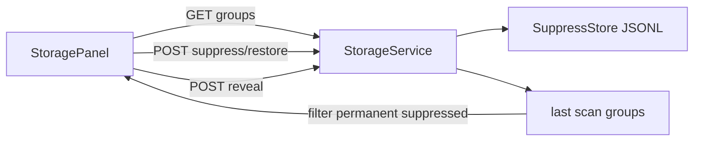

# feat: Storage review accelerators (R12)

## Summary

Polish the shipped Storage surface so large duplicate libraries are faster to review: dupes-only view, group display filters, a persistent suppress list for false positives, keyboard selection, and double-click reveal-in-file-manager. All changes extend R4 — no new scan engine work.

---

## Problem Frame

R4 delivers correct grouping, safe reclaim, and quarantine — but reviewing hundreds of groups on a multi-TB library is still slow. Users must scroll past keeper rows, cannot filter to "groups I haven't finished reviewing," and cannot dismiss known false positives without re-seeing them on every scan. dupeGuru and AllDup solve this with dupes-only view, group filters, and ignore lists — patterns we deferred from R4.

## Requirements (traceability)

| ID | Requirement |
|----|-------------|
| R12.1 | **Dupes-only toggle** — when on, expanded group rows hide the keeper; group header still shows keeper path and reclaimable bytes. |
| R12.2 | **Group display filter** — dropdown: All · Partially reviewed · Fully selected · Unreviewed (no selections in group). |
| R12.3 | **Selection-scoped bulk rule** — "Select redundant copies" applies only to **expanded** groups (AllDup pattern), not every group in the list. |
| R12.4 | **Suppress group** — per-group action removes it from current results; optional "also hide on future scans" persists by content digest. Distinct from quarantine (post-delete recovery). |
| R12.5 | **Manage suppressed** — list suppressed digests with restore; count visible in Storage toolbar. |
| R12.6 | **Keyboard** — Space toggles selection on the focused member row; arrow keys move focus; Enter expands/collapses group header. |
| R12.7 | **Reveal path** — double-click a member row opens its parent directory in the OS file manager (loopback server only; path must be under configured roots). |

## Assumptions

- R4 APIs and `StoragePanel` are shipped and stable (`qbx/storage.py`, `qbx/engine/content_dedupe.py`, `qbx/web/matcher/src/components/StoragePanel.tsx`).
- Suppress state is operational, not configuration — it belongs in the qbx state dir, not `config.toml`.
- Reveal-in-file-manager is best-effort on Linux via `xdg-open` on the parent directory; unsupported platforms return a clear error toast.
- No URL-persisted filter state in R12 (that is R10).

## Key Technical Decisions

- **KTD1. Suppress persistence = JSONL in state dir.** New `SuppressStore` in `qbx/engine/content_dedupe.py` (alongside `QuarantineStore` / `AuditLog`), file `storage-suppressed.jsonl` under `ConfigStore.dir`. Rows: `{id, digest, ts, reason?, permanent: bool}`. `permanent` rows are filtered in `StorageService.groups_payload()`; session-only suppress is client-side `Set<string>` of digests (cleared on reload). Rationale: matches audit/quarantine pattern; avoids soft-config churn for throwaway triage.

- **KTD2. Dupes-only and group filters are client-side.** No new API fields. Filter pipeline in `StoragePanel`: `groups → displayFilter → expanded render`. Keeps scan snapshot authoritative; filters are view state.

- **KTD3. Focus model = roving tabindex on member rows.** Group headers are focus stops for expand/collapse; member rows inside expanded groups are the Space-toggle targets. First Tab into the table lands on the toolbar; arrow navigation only active when the table has focus.

- **KTD4. Reveal endpoint is a guarded one-liner.** `POST /api/storage/reveal` body `{path}` — resolve path, verify `under_any_root(path, roots)`, `subprocess` or `os.startfile` / `xdg-open` on `path.parent`. Reject paths under quarantine. No file content access.

- **KTD5. Bulk rule scopes to expanded groups only.** Change `applyRuleToAll` to iterate `groups.filter(g => expanded.has(g.digest))`; if none expanded, toast "Expand groups first or use Select all" with a secondary "Expand all + select" action.

## High-Level Design



**Filter pipeline (client):**

```
apiGroups
  → minus sessionSuppressed (Set)
  → minus permanentSuppressed (from GET /api/storage/suppressed)
  → groupDisplayFilter (all | partial | full | none)
  → render (dupesOnly hides keeper row in expanded members)
```

## Implementation Units

### U1. SuppressStore + API routes

**Goal:** Persist and query suppressed duplicate groups by digest.

**Requirements:** R12.4, R12.5

**Files:**
- `qbx/engine/content_dedupe.py` — add `SuppressStore` class
- `qbx/storage.py` — wire store, filter `groups_payload`, `suppress()` / `restore()` / `list_suppressed()`
- `qbx/server.py` — `GET /api/storage/suppressed`, `POST /api/storage/suppress`, `POST /api/storage/suppressed/restore`
- `qbx/web/matcher/src/api/backend.ts` — DTOs + `StorageService.suppress` / `restoreSuppressed` / `listSuppressed`
- `tests/test_content_dedupe.py` — SuppressStore round-trip
- `tests/test_server.py` — suppress + groups no longer returns suppressed digest

**API sketch:**

| Method | Path | Body | Response |
|--------|------|------|----------|
| GET | `/api/storage/suppressed` | — | `{items: [{id, digest, ts, permanent}]}` |
| POST | `/api/storage/suppress` | `{digest, permanent?: bool}` | `{ok, id}` |
| POST | `/api/storage/suppressed/restore` | `{ids: string[]}` | `{restored: number}` |

**Test scenarios:**
- Suppress permanent digest → `groups` omits that digest until restored.
- Suppress unknown digest → 404 or skip with reason.
- Restore removes from JSONL; next `groups` includes it again.
- Audit row appended on suppress/restore (reuse `AuditLog`).

---

### U2. StoragePanel filters and dupes-only

**Goal:** Faster visual scanning of large result sets.

**Requirements:** R12.1, R12.2, KTD2

**Files:**
- `qbx/web/matcher/src/components/StoragePanel.tsx`

**UI additions (toolbar row):**
- Checkbox or toggle: **Dupes only**
- `<select>`: Group filter — All / Unreviewed / Partially reviewed / Fully selected
- Badge: `N suppressed` (click opens suppressed manager popover)

**Logic:**
- `unreviewed`: no entry in `decisions[digest]`
- `partial`: some but not all eligible losers selected
- `full`: all eligible losers selected (keeper excluded, protected excluded, same-inode excluded)
- Dupes-only: in `GroupRows`, skip rendering member where `member.path === keeper`

**Test scenarios (manual / future component test):**
- Dupes-only hides keeper row; reclaim totals unchanged.
- Partial filter shows only groups with 1..n-1 losers selected.
- Session suppress hides group until reload; permanent suppress survives reload.

---

### U3. Selection-scoped bulk rule + expand helpers

**Goal:** Bulk selection respects which groups the user is actually reviewing.

**Requirements:** R12.3, KTD5

**Files:**
- `qbx/web/matcher/src/components/StoragePanel.tsx`

**Changes:**
- `applyRuleToAll` → only `expanded` groups; toast if empty.
- Add **Expand all** / **Collapse all** buttons next to group table.
- Optional: **Expand all + select** single action for power users.

**Test scenarios:**
- With 10 groups, 2 expanded → bulk rule touches 2 only.
- Expand all + select marks all eligible losers across all groups.

---

### U4. Keyboard navigation + reveal endpoint

**Goal:** Keyboard-first review and OS folder reveal.

**Requirements:** R12.6, R12.7, KTD3, KTD4

**Files:**
- `qbx/web/matcher/src/components/StoragePanel.tsx` — focus state, keydown handler
- `qbx/server.py` — `POST /api/storage/reveal`
- `qbx/web/matcher/src/api/backend.ts` — `StorageService.reveal(path)`
- `tests/test_server.py` — reveal rejects path outside roots; accepts path under root (mock subprocess)

**Keyboard map:**

| Key | Context | Action |
|-----|---------|--------|
| Space | member row focused | toggle select (same as checkbox) |
| ↑/↓ | table focused | move focus prev/next focusable row |
| Enter | group header focused | toggle expand |
| Enter | member row focused | reveal path (same as double-click) |

**Reveal:** double-click member path cell → `StorageService.reveal(path)` → toast success or error.

**Test scenarios:**
- Path outside roots → 403.
- Path under quarantine → 403.
- Valid path → subprocess called with parent dir (mocked in tests).

---

### U5. Docs and command palette

**Goal:** Discoverability and operator docs.

**Requirements:** (supporting)

**Files:**
- `website/guides/control-shell.md` — document dupes-only, suppress, keyboard
- `website/api/index.md` — suppress + reveal routes
- `qbx/web/matcher/src/lib/actions.ts` — optional: "Suppress selected groups" not needed (per-group UI is enough)
- `docs/CONFIGURATION.md` — note suppress is state-dir, not config

---

## Sequencing

1. **U1** (suppress backend) — unblocks permanent hide
2. **U2 + U3** (filters + bulk scope) — pure frontend, can parallel after U1 API client types exist
3. **U4** (keyboard + reveal) — independent
4. **U5** (docs) — last

## Risks

| Risk | Mitigation |
|------|------------|
| Reveal opens arbitrary paths | Strict `under_any_root` guard; parent dir only |
| Suppress by digest hides content that changed | Digest is content-keyed; if files change, group may reappear under new digest — acceptable |
| Keyboard conflicts with browser scroll | Only handle keys when table container has `data-focus-within` |
| Large expanded-all + select marks thousands | Confirm unchanged (R4 confirm step still gates action) |

## Verification

```bash
pytest tests/test_content_dedupe.py tests/test_server.py -q -k storage
cd qbx/web/matcher && npm run lint && npx tsc --noEmit && npm run build
```

**Manual:**
1. Scan a tree with 3+ duplicate groups.
2. Toggle dupes-only — keeper rows disappear.
3. Filter "Unreviewed" — only untouched groups show.
4. Suppress one group permanently — rescan or reload — group stays hidden.
5. Restore from suppressed list — group returns.
6. Space-toggle a row, double-click reveal opens file manager on parent folder.

## Out of Scope (R12)

- URL-persisted filters (R10)
- Needs-attention queue (R1)
- Thumbnails / content preview
- Suppress by path prefix (digest-only in v1)

## Open Questions (resolved in this plan)

| Question | Decision |
|----------|----------|
| Suppress in config or state dir? | State dir JSONL (`storage-suppressed.jsonl`) |
| Session vs permanent suppress? | Both: session = client Set; permanent = server store |
