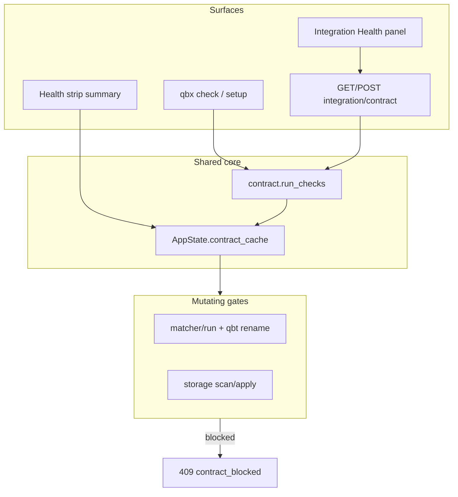

# feat: First-run trust (integration contract)

## Summary

Add a shared **integration contract checker** that validates configured paths, writability, symlinks, and qBittorrent save-path alignment before automation runs. Surface results in `qbx check`, a dedicated HTTP endpoint, and a Control Shell Integration Health panel. **Hard contract failures block** matcher apply paths and storage scan/apply server-side (see origin: user chose block-on-failure, not warn-only).

---

## Problem Frame

`qbx check` proves credentials work but not that `matcher.folders`, `content_dupes.roots`, and qBittorrent save paths describe the same disk reality. Path mistakes surface days later as failed Sonarr imports or matcher placements into nowhere. Homelab operators — especially in Docker — need fast, actionable proof that automation is safe to run. (see origin: `docs/brainstorms/2026-07-25-qbx-first-run-trust-requirements.md`)

## Requirements (traceability)

| ID | Requirement |
|----|-------------|
| T1 | Shared integration contract checker with structured check results |
| T2 | Extend `qbx check` (+ optional `--json`); `qbx setup` ends with contract pass |
| T3 | Contract HTTP API with aggregate `ok` / `degraded` / `blocked` status |
| T4 | Control Shell Integration Health panel with run-on-demand and remediation links |
| T5 | Server-side block on matcher/storage mutating endpoints when `blocked` |
| T6 | Setup and Settings path guidance (library vs downloads, Docker path note) |
| T7 | Matcher **Preview changes** via existing `dry_run` semantics in UI |
| T8 | Re-run contract after Matcher path saves; optional startup log summary |

## Assumptions

- qBittorrent WebAPI exposes `save_path` in `GET /app/preferences` and per-category `savePath` in `GET /torrents/categories` (`qbx/qbt/client.py` — methods exist but are unused today).
- `content_dupes` has no Settings UI yet; contract checks still read config; T8 hooks `matcher.folders` soft-save first; optional minimal `content_dupes.roots` field in Matcher/Storage settings section is acceptable in U6 if low-cost.
- `qbx serve` **does not** refuse to bind on contract failure — startup logs a one-line summary; only mutating endpoints are blocked (resolves origin open question).
- Interceptor/debrid flows are out of scope for blocking in v1; only matcher placement and storage reclaim gates.

## Key Technical Decisions

- **KTD1. Module location = `qbx/contract.py`.** Pure checker + small `ContractService` wrapper for caching. Callable from CLI without running the full server; server holds last result on `AppState`. Rationale: mirrors `qbx/storage.py` service pattern without over-nesting under `engine/`.

- **KTD2. Dedicated API, lean health summary.** `GET /api/integration/contract` returns full payload; `POST /api/integration/contract/run` forces refresh. `/api/health` gains optional `contract: { status, hard_fails, soft_warns, checked_at }` only — keeps health fast (see `qbx/server.py` health comment). Rationale: avoids bloating the liveness probe.

- **KTD3. Hard vs soft classification (v1).**

  | Check | Severity |
  |-------|----------|
  | Configured root path missing or not a directory | hard |
  | Root not writable (probe create/delete) | hard |
  | Configured root is broken symlink | hard |
  | Duplicate path listed in multiple config keys | soft |
  | Protected root is subset of scan-only root (overlap) | soft |
  | qBT unreachable during check | soft (credentials already fail `qbx check`) |
  | qBT default `save_path` not under any matcher/content_dupes root | soft |
  | Interceptor `category_filter` set but category missing in qBT | soft |

- **KTD4. Writability probe = `.qbx-probe/.write-test`.** Create parent dir if needed, write+unlink a tiny file under each root. Rationale: avoids littering library root; permission-sensitive mounts can deny `.qbx-probe` without touching media files.

- **KTD5. Blocked endpoints (HTTP 409, detail `contract_blocked`).** Body includes `primary_check` (id, title, remediation). Guarded routes:
  - `POST /api/matcher/run` (including `dry_run=true` per origin T7)
  - `POST /api/qbt/rename-file`, `POST /api/qbt/file-priority`, `POST /api/qbt/recheck` when invoked from placement apply flows
  - `POST /api/storage/scan`, `POST /api/storage/apply`
  - Read-only matcher preview (`scan`, `find`, `renames`, `dir-exists`) stays allowed when degraded/blocked so users can diagnose.

- **KTD6. CLI `--json`.** Machine-readable output for scripting; same check list as HTTP API. Human lines remain default.

## High-Level Design



**Check pipeline (ordered):**

```
collect paths from matcher.folders + content_dupes.roots + content_dupes.protected_roots
  → dedupe + classify overlaps (soft)
  → per-path: exists, is_dir, resolve symlink, writability probe
  → optional qBT: login, preferences.save_path, categories, category_filter
  → aggregate status: blocked if any hard; else degraded if any soft; else ok
```

---

## Implementation Units

### U1. Contract checker core

**Goal:** Single source of truth for path and qBT alignment validation.

**Requirements:** T1

**Dependencies:** none

**Files:**
- `qbx/contract.py` (new) — `CheckResult`, `ContractReport`, `run_checks(store, qbt=None)`
- `tests/test_contract.py` (new)

**Approach:**
- Sync filesystem checks; async qBT section only when client provided and login succeeds.
- Each check: stable `id` (e.g. `root_missing:path`), `severity`, `title`, `detail`, `remediation`, `settings_section` (`matcher` | `content_dupes` | `connection`).
- Empty roots: if both matcher folders and content_dupes roots empty, one soft check `no_roots_configured` (storage already 409s — align messaging).

**Patterns to follow:** `qbx/storage.py` `roots()` fallback; `qbx/engine/disk_index.py` `under_any_root` for qBT path comparison.

**Test scenarios:**
- Happy path: tmp dirs writable → `status=ok`.
- Missing folder → hard fail `root_missing`.
- Read-only dir → hard fail `root_not_writable`.
- Broken symlink root → hard fail `root_broken_symlink`.
- Protected root inside scan root → soft warn `protected_overlap`.
- Fake qBT preferences with save_path outside roots → soft `qbt_save_path_outside_roots`.

**Verification:** `pytest tests/test_contract.py` passes.

---

### U2. CLI `qbx check` + `--json`

**Goal:** Operators see contract failures at setup time; scripts can gate deploys.

**Requirements:** T2, T6 (copy only)

**Dependencies:** U1

**Files:**
- `qbx/cli.py` — extend `_check`, add `--json` to check subparser
- `tests/test_contract.py` — CLI integration via `_check` with mocked qBT/debrid

**Approach:**
- After existing credential checks, call `run_checks(store, qbt)` when qBT login succeeded; else filesystem-only checks.
- Set `ok = False` on any hard contract fail (exit 2).
- `--json`: emit `{ credentials: {...}, contract: ContractReport }`.
- `_setup`: add 2–3 lines of printed guidance after path-related prompts (library vs downloads); no new prompts required in v1.

**Test scenarios:**
- Hard contract fail → exit code 2 even when credentials OK.
- `--json` output parses; includes `contract.status`.
- Credentials fail → contract may still run filesystem checks (document behavior).

**Verification:** `pytest tests/test_contract.py -k check` passes.

---

### U3. Contract HTTP API + health summary

**Goal:** Control Shell and header strip read contract state without full health payload.

**Requirements:** T3, T8 (cache timestamp)

**Dependencies:** U1

**Files:**
- `qbx/server.py` — routes, `AppState` cache field, startup log line
- `qbx/web/matcher/src/api/backend.ts` — `ContractReport` types, `IntegrationService`
- `tests/test_server.py` — contract endpoint tests

**API:**

| Method | Path | Response |
|--------|------|----------|
| GET | `/api/integration/contract` | Cached report or run if stale/missing |
| POST | `/api/integration/contract/run` | Force refresh, return report |

Report shape: `{ status, hard_fails, soft_warns, checked_at, checks: [{ id, severity, title, detail, remediation, settings_section }] }`.

**Approach:**
- `AppState` stores `contract_report` + `contract_checked_at`; refresh on POST and on first GET if older than 60s (configurable constant).
- Extend `GET /api/health` with `contract` summary object only.
- On `create_app` / lifespan: run checks once in background thread or after first request — **log** `contract blocked: N hard fail(s)` at WARNING; do not delay bind.

**Test scenarios:**
- GET returns checks list after config with valid tmp roots.
- POST after deleting a root updates status to `blocked`.
- Health includes `contract.status` without full checks array.

**Verification:** `pytest tests/test_server.py -k contract` passes.

---

### U4. Server-side mutation guards

**Goal:** Matcher and storage cannot mutate disk/qBT when contract is blocked.

**Requirements:** T5

**Dependencies:** U1, U3

**Files:**
- `qbx/server.py` — `_require_contract_ok(state)` helper; apply to guarded routes
- `qbx/storage.py` — optional defense-in-depth in `start_scan` / `apply`
- `tests/test_server.py`

**Approach:**
- Helper ensures fresh report (use cache from U3); if `status == blocked`, raise `HTTPException(409, detail={ "reason": "contract_blocked", "primary_check": {...} })`.
- Apply to routes in KTD5 list.
- MatchingPanel rename loop uses `qbt/rename-file` — must hit guard.

**Test scenarios:**
- Valid contract → storage scan accepted.
- Delete configured root, refresh contract → storage scan 409 `contract_blocked`.
- matcher/run with dry_run=true also 409 when blocked (per origin T7).
- matcher/find still 200 when blocked.

**Verification:** guarded route tests pass.

---

### U5. Integration Health panel (UI)

**Goal:** Discoverable contract status without CLI.

**Requirements:** T4

**Dependencies:** U3

**Files:**
- `qbx/web/matcher/src/components/IntegrationHealthPanel.tsx` (new) or section in `SettingsPanel.tsx`
- `qbx/web/matcher/src/App.tsx` — health strip badge when not `ok`
- `qbx/web/matcher/src/components/SettingsPanel.tsx` — nav entry or Application section link

**Approach:**
- Panel lists checks grouped by severity; **Run checks** calls `POST /api/integration/contract/run`.
- Row remediation links open Settings with `setSettingsSection('matcher')` etc.
- Header badge: `blocked` destructive, `degraded` outline, hidden when `ok`.
- Docker hint banner when `window.location.hostname` is not localhost AND paths look absolute under `/config` or `/data` — static copy, no detection magic.

**Test scenarios:** Manual: blocked state shows badge; Run checks refreshes list; click remediation opens Settings.

**Verification:** `npm run build` succeeds; manual smoke in Control Shell.

---

### U6. Settings path guidance + optional content_dupes fields

**Goal:** Teach library vs download mental model; enable contract re-check on path edits.

**Requirements:** T6, T8 (partial)

**Dependencies:** U3

**Files:**
- `qbx/web/matcher/src/components/SettingsPanel.tsx`
- `qbx/cli.py` `_setup` strings
- `website/guides/control-shell.md`, `docs/GETTING_STARTED.md` (brief)

**Approach:**
- Matcher section: helper text under folders field (protected library vs incomplete downloads).
- Optional: comma-separated `content_dupes.roots` + `protected_roots` fields with same blur→soft-patch pattern (low-cost; unblocks storage contract visibility).
- After successful `applySoft` touching `matcher.folders` or `content_dupes`, call `IntegrationService.run()` and toast if newly `blocked`.

**Test scenarios:**
- Saving invalid folder path → contract run → toast warning with primary check title.

**Verification:** manual Settings save flow.

---

### U7. Matcher dry-run preview in UI

**Goal:** Preview renames before apply; respects contract block.

**Requirements:** T7

**Dependencies:** U4, U5 (for disabled state messaging)

**Files:**
- `qbx/web/matcher/src/components/MatchingPanel.tsx`
- `qbx/web/matcher/src/api/backend.ts` (already has `dry_run` on `MatcherService.Run`)

**Approach:**
- Add **Preview changes** button calling `MatcherService.Run({ hash, path, dry_run: true })`; show rename list from response `plan` / `applied` empty.
- **Apply** disabled when `contract.status === 'blocked'`; tooltip shows `primary_check.title`.
- Prefer `MatcherService.Run` over per-file rename loop for apply in a follow-up (out of scope) — v1: guard `rename-file` server-side even if UI still uses loop.

**Test scenarios:**
- Preview succeeds on valid contract; shows planned renames.
- When blocked, Preview returns 409; UI shows error toast with remediation.

**Verification:** manual match workspace flow.

---

### U8. Docs and operator references

**Goal:** Document contract checks and blocking behavior for CLI and API users.

**Requirements:** T2, T3, T5 (supporting)

**Dependencies:** U1–U4

**Files:**
- `website/api/index.md`
- `website/cli/index.md`
- `docs/GETTING_STARTED.md`
- `docs/CONFIGURATION.md` (probe dir note)

**Approach:** Document endpoints, `qbx check --json`, hard vs soft table, which actions are blocked, `.qbx-probe` behavior.

**Test expectation:** none — documentation only.

**Verification:** docs render in website build if applicable.

---

## Sequencing

```
U1 → U2 + U3 (parallel) → U4 → U5 + U6 + U7 (parallel after U4) → U8
```

U4 is the behavioral core for trust; UI units depend on API + guards.

## Scope Boundaries

**In scope:** T1–T8 as defined in origin doc.

**Deferred for later (origin):** Sonarr/Radarr import simulation; auto-fix paths; fake-qB API; interceptor blocking; Prometheus.

**Deferred to follow-up work:** Refactor MatchingPanel apply to use `matcher/run` instead of per-file `rename-file` (reduces duplicate guard surface).

**Outside product identity:** Silent warn-only weakening of hard blocks (user explicitly rejected).

## Open Questions (deferred to implementation)

- Exact qBT preference key if `save_path` absent on older qBT — handle KeyError gracefully as soft `qbt_preferences_unavailable`.
- Whether to add `content_dupes` Settings fields in U6 or defer to a storage-focused settings pass.

## Risks & Dependencies

| Risk | Mitigation |
|------|------------|
| Probe write fails on NFS/SMB with root_squash | Document `.qbx-probe`; remediation names mount options |
| qBT login doubles check latency | Cache report 60s; CLI runs qBT checks only after login success |
| Health payload growth | Summary-only on `/api/health`; full list on contract endpoint |
| MatchingPanel bypasses `matcher/run` | Guard `rename-file` in U4 |
