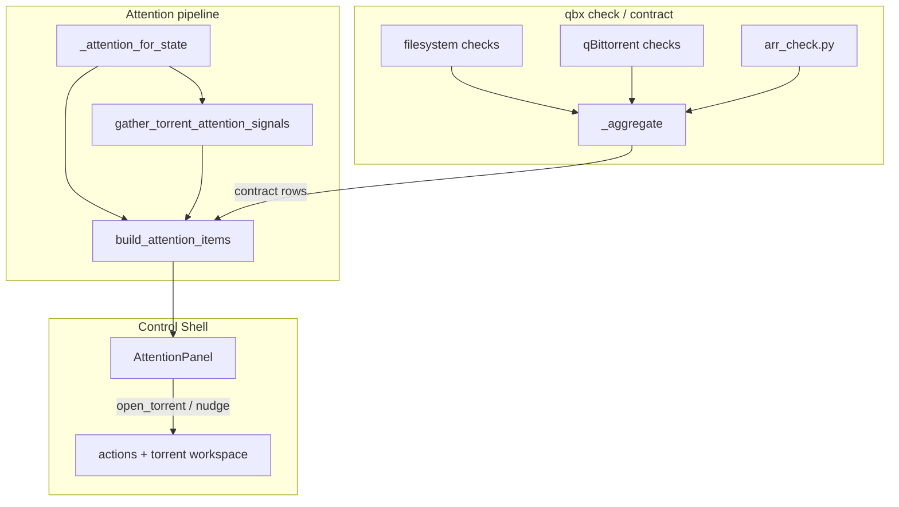

# feat: Wave 2 foundation (stack paths + torrent attention)

## Summary

Complete the **stack path contract** (W2-1) beyond the existing `qbx/arr_check.py` slice, then add **`kind: torrent` attention rows** (W2-2) with minimal Control Shell parity (W2-3). Operators see path misalignment in `qbx check` and Overview before *arr imports fail, and see stalled/failed torrents on the home queue with one safe action each.

**Prerequisite:** merge stabilize wave from `fix/stabilize-s2-s4` before or as the first commit on the implementation branch.

---

## Problem Frame

Path mismatch is the dominant arrstack failure mode; qbx already checks qBittorrent and matcher roots but only partially checks *arr alignment. Overview attention covers contract, interceptor aggregate signals, and storage — not per-torrent stalled or failed states. (see origin: `docs/brainstorms/2026-07-25-qbx-wave2-foundation-requirements.md`)

## Requirements (traceability)

| ID | Requirement | Plan units |
|----|-------------|------------|
| W2-1 | Stack path contract — *arr roots + qB cross-alignment | U1, U2 |
| W2-2 | Torrent attention rows (stalled, debrid failed, matcher failed) | U3, U4 |
| W2-3 | Control Shell renders torrent rows + primary actions | U5 |
| — | Docs for `arr` config and new checks | U2, U6 |

## Assumptions

- **Stalled threshold** reuses `interceptor.stalled_min_minutes` (origin open question resolved here — no separate attention threshold in v1).
- **Radarr + Sonarr only** — `ArrConfig` already models these; Lidarr/Readarr deferred.
- Attention torrent fetch is **bounded** (e.g. max 20 rows, category-filtered to non-local-only) to keep `/api/attention` fast.
- Matcher failure rows require **new ephemeral state** — `matcher_run` does not persist errors today; U3 adds a small in-memory `last_matcher_error: dict[hash, {detail, ts}]` on `AppState`, cleared on success.
- Stabilize-wave behavior (409 guards, token prompt, error formatting) is unchanged.

## Key Technical Decisions

- **KTD1. Extend `qbx/arr_check.py`, not a new module.** Existing `arr_contract_checks()` is wired into `run_checks_async`. Add cross-path checks here and in `_qbt_checks` where qBittorrent data is already available.

- **KTD2. Path alignment model = shared ancestor under configured roots.** For each enabled *arr service, verify root folders are under `matcher.folders` ∪ `content_dupes.roots` (already done). **New:** when qBittorrent preferences are available, verify default `save_path` and per-category `savePath` values share a resolved ancestor with at least one *arr root folder (soft warn). Emit check ids like `arr_sonarr_download_namespace_mismatch` with both paths in `detail` and TRaSH-style remediation (`DOCKER_DATA_HINT` from `qbx/contract.py`).

- **KTD3. Torrent signals collected in server, not inside pure `build_attention_items`.** Add `async def gather_torrent_attention_signals(state: AppState) -> list[TorrentSignal]` (new small dataclass in `qbx/attention.py` or `qbx/torrent_attention.py`). Server `_attention_for_state` calls it alongside contract/interceptor/storage. Keeps `build_attention_items` testable with injected signals.

- **KTD4. Stalled torrent detection mirrors interceptor eligibility.** Query `stalledDL` torrents via `QbtClient.torrents(filter="stalledDL", ...)`, exclude `local_only_categories` (including `""` per product default), require `state == stalledDL` and `added_on` older than `stalled_min_minutes`. Severity: `warning` if past threshold, not `critical` unless also tagged `qbx-failed`.

- **KTD5. Debrid failure rows from `qbx-failed` tag + `recent_decisions`.** Reuse interceptor `TAG_FAILED` and latest matching `TorrentDecision` reason (same logic as `overlay_for`). Severity `critical` when tag present; primary action `open_torrent` with hash in `href`.

- **KTD6. Primary action vocabulary (extends existing AttentionPanel switch):**

  | `primary_action.type` | Behavior |
  |-----------------------|----------|
  | `open_torrent` | Navigate to `/?view=torrents&hash=<hash>` |
  | `nudge_torrent` | `POST /api/torrents/{hash}/nudge` then refresh |
  | (existing) | `open_settings`, `open_storage`, `open_torrents`, `interceptor_scan` |

- **KTD7. Settings UI for `arr` config.** Add Connection or Matcher subsection in `SettingsPanel.tsx` for Sonarr/Radarr enable + URL + API key. Redact `arr.*.api_key` in `ConfigStore.redacted()`.

## High-Level Design

---

## Implementation Units

### U1. Complete stack path contract checks

**Goal:** Finish W2-1 beyond existing *arr-root-under-qbx-roots checks.

**Requirements:** W2-1

**Dependencies:** None (builds on `qbx/arr_check.py`, `qbx/contract.py`)

**Files:**
- `qbx/arr_check.py` — add download-namespace cross-check when qBT prefs passed in or fetched inside arr checks
- `qbx/contract.py` — pass qBT save paths into arr cross-check helper; optional `arr_qbt_common_root` soft check
- `tests/test_arr_check.py` (new) or extend `tests/test_contract.py`

**Approach:**
- Refactor `arr_contract_checks(store)` → `arr_contract_checks(store, qbt: QbtClient | None = None)` so `run_checks_async` passes the live client.
- When *arr roots and qBT `save_path`/category paths exist, compute resolved paths; soft-warn if no shared ancestor within configured matcher/content_dupes roots.
- Keep all new checks **soft** (snoozable) unless path is literally missing.

**Patterns to follow:** `CheckResult` shape in `qbx/contract.py`; existing `arr_sonarr_root_outside` id pattern.

**Test scenarios:**
- Enabled Sonarr with root `/data/tv` and matcher folders `["/data"]` → no new mismatch check.
- qBT save `/downloads` and Sonarr root `/data/tv` with matcher roots only `/data` → `arr_*_download_namespace_mismatch` soft check.
- Disabled *arr → no arr API calls, no new checks.
- *arr API unreachable → existing `arr_*_unreachable` preserved.

**Verification:** `qbx check --json` lists new check ids when misaligned; contract snooze still rejects hard checks only.

---

### U2. *arr config in Settings + redaction + docs

**Goal:** Operators can configure Sonarr/Radarr without hand-editing TOML.

**Requirements:** W2-1 (operational prerequisite for checks)

**Dependencies:** None

**Files:**
- `qbx/web/matcher/src/components/SettingsPanel.tsx`
- `qbx/web/matcher/src/api/backend.ts` — types for `arr` if missing
- `qbx/config.py` — redact `arr.*.api_key` in `redacted()`
- `docs/CONFIGURATION.md` — `arr.sonarr` / `arr.radarr` table
- `website/configuration/index.md` — mirror if other server options documented there

**Approach:** Collapsible "Sonarr / Radarr" block under Connection or Matcher: enabled toggle, URL, API key (password input). Save via existing config PATCH pattern.

**Test scenarios:**
- Test expectation: none — UI + docs; manual verify in shell.

**Verification:** Saving config persists `arr.radarr.enabled`; diagnostics bundle redacts API keys.

---

### U3. Torrent attention signal collector

**Goal:** Produce structured stalled/failed torrent signals for attention aggregation.

**Requirements:** W2-2

**Dependencies:** None

**Files:**
- `qbx/attention.py` or new `qbx/torrent_attention.py`
- `qbx/server.py` — record `matcher_last_error` on `matcher_run` exception; clear on success
- `tests/test_torrent_attention.py` (new)

**Approach:**
- Define `TorrentSignal` dataclass: `hash`, `name`, `condition` (`stalled` | `debrid_failed` | `matcher_failed`), `detail`, `severity`, `category`.
- `gather_torrent_attention_signals(state)`:
  - Stalled: qBT list query, filter by `stalled_min_minutes` + category policy.
  - Debrid failed: torrents with `qbx-failed` tag (batch query or filter tags).
  - Matcher failed: read `state.matcher_last_errors` dict (cap age e.g. 24h).
- Dedupe by `(hash, condition)` in collector.

**Execution note:** Add unit tests with mocked `QbtClient` and fake interceptor stats before wiring server.

**Test scenarios:**
- Stalled torrent in `radarr` category past threshold → one `stalled` signal.
- Uncategorized torrent (`""`) → excluded (local-only default).
- Torrent with `qbx-failed` → `debrid_failed` signal with reason from `recent_decisions`.
- Matcher error recorded → `matcher_failed` signal until cleared.

**Verification:** Collector returns expected signals in isolation tests.

---

### U4. Emit `kind: torrent` attention items

**Goal:** Wire signals into `build_attention_items` and HTTP attention payload.

**Requirements:** W2-2

**Dependencies:** U3

**Files:**
- `qbx/attention.py` — extend `build_attention_items(..., torrent_signals=...)`
- `qbx/server.py` — `_attention_for_state` awaits collector
- `tests/test_attention.py` — torrent row cases

**Approach:**
- Map each `TorrentSignal` → `AttentionItem` with `kind="torrent"`, id `torrent:<hash>:<condition>`, `href` `/?view=torrents&hash=...`, `primary_action` per condition (`nudge_torrent` for stalled, `open_torrent` for failures).
- Sort with existing severity order; cap total torrent rows (e.g. 15) after sort.
- Do not duplicate interceptor aggregate rows (`interceptor:pending`) for same hash.

**Test scenarios:**
- Injected stalled signal → item with `kind torrent`, severity warning.
- Injected debrid_failed → critical, detail contains error text.
- Two conditions same hash → two items with distinct ids.
- Over cap → lowest severity/info dropped first.

**Verification:** `GET /api/attention` includes torrent items when signals present (server test optional if unit coverage sufficient).

---

### U5. Control Shell attention actions

**Goal:** W2-3 — render torrent rows and handle new primary actions.

**Requirements:** W2-3

**Dependencies:** U4

**Files:**
- `qbx/web/matcher/src/components/AttentionPanel.tsx`
- `qbx/web/matcher/src/App.tsx` — hash deep link on torrent surface if not already
- `qbx/web/matcher/src/api/backend.ts` — `AttentionItem` primary_action union

**Approach:**
- Display torrent name in row subtitle from `detail` or new optional `subtitle` field on item dict.
- `open_torrent`: `window.location` or app router to `/?view=torrents&hash=...`
- `nudge_torrent`: call existing torrent nudge API; toast + refresh.
- Badge counts already use `open_count` — no change if torrent items included in payload counts.

**Test scenarios:**
- Test expectation: none — UI; manual verify stalled row nudge and failed row navigation.

**Verification:** Clicking primary action on stalled row queues scan; failed row opens torrent workspace.

---

### U6. Documentation and requirements status

**Goal:** Keep docs and brainstorm artifacts current.

**Requirements:** W2-1, W2-3

**Dependencies:** U1–U5

**Files:**
- `docs/ARCHITECTURE.md` — note torrent attention + arr checks
- `docs/brainstorms/2026-07-25-qbx-wave2-foundation-requirements.md` — mark W2-* shipped
- `docs/brainstorms/2026-07-25-qbx-operations-console-requirements.md` — bump R1 partial → closer to shipped

**Test scenarios:** Test expectation: none — docs only.

**Verification:** Requirements status tables reflect shipped behavior.

---

## Scope Boundaries

**In scope:** U1–U6.

### Deferred to Follow-Up Work

| Item | Notes |
|------|-------|
| B5 Interceptor dry-run | Stretch after W2 complete |
| S8 Health `ok` semantics | P2; separate small fix |
| B3 SSE badge refresh | Not required for torrent rows v1 |
| Lidarr/Readarr | No config slots yet |
| *arr remote path mapping auto-detect | Report symptom only, not RPM translation |

**Outside identity:** auto-repair paths, Prometheus, virtual qBittorrent client.

## Open Questions

- None blocking — stalled threshold and *arr scope locked in Assumptions.

## Risks and Dependencies

| Risk | Mitigation |
|------|------------|
| `/api/attention` slows with qBT list fetch | Cap torrent queries; reuse interceptor sync cache if available later |
| False-positive stalled rows | Require `stalled_min_minutes` + `stalledDL` state; exclude local-only categories |
| *arr API version drift | Use `/api/v3/rootfolder` (Sonarr/Radarr shared); soft-fail on 404 |

**Branch sequencing:** Land stabilize PR first to avoid merge conflicts in `server.py`, `attention.py`, `SettingsPanel.tsx`.

---

## Sources and Research

- Origin: `docs/brainstorms/2026-07-25-qbx-wave2-foundation-requirements.md`
- Existing partial impl: `qbx/arr_check.py`, `ArrConfig` in `qbx/config.py`
- TRaSH Guides Docker path pattern — single `/data` root across containers
- Local patterns: `qbx/contract.py`, `tests/test_attention.py`, `AttentionPanel.tsx` action switch
