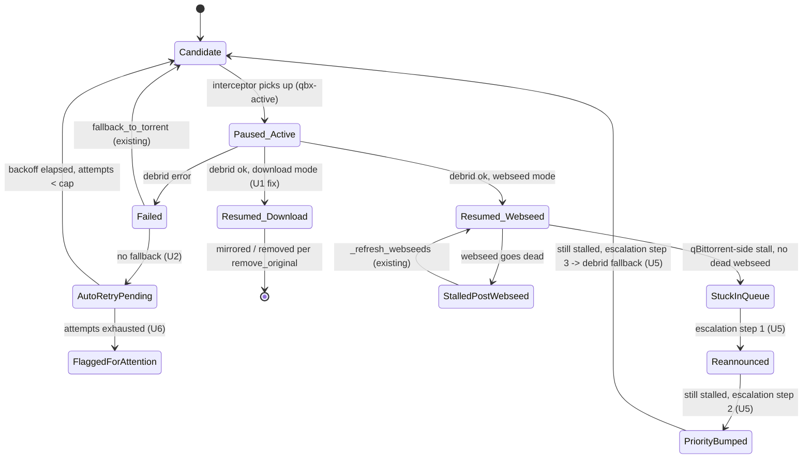

# Active Download Manager: stop silent pauses, close the retry loop

## Summary

qbx pauses torrents at several points in its debrid workflow but does not
guarantee every pause has an automatic way back to resumed, debrided, or
clearly-flagged-for-attention. This plan closes those gaps, adds an active
recovery sweep for torrents that stall inside qBittorrent's own queue after
qbx has already touched them, makes the resulting state visible in the
attention queue, and reframes `AGENTS.md` around qbx's actual product
identity: a debrid-accelerated, actively-managed qBittorrent download queue,
not just a one-shot debrid bridge.

## Problem Frame

On an 11k-torrent library, torrents accumulate in a paused/stopped state with
no automatic recovery, forcing manual per-torrent "Retry failed" clicks. Code
inspection of `qbx/engine/interceptor.py` confirms three independent causes,
plus a visibility gap that hides all of them from the operator:

- `_handle()`'s non-webseed (`delivery_mode: "download"`) success path pauses
  the torrent, downloads via debrid, then never calls `qbt.resume()` —
  unlike the webseed branch a few lines above it, which explicitly resumes
  (`interceptor.py:3044` vs. the download branch ending at `interceptor.py:3112`
  with no resume call). With `remove_original` off (the default), the
  original torrent is paused forever.
- `_on_failure()` only resumes the torrent when `fallback_to_torrent` is
  true (`interceptor.py:3184-3210`); otherwise it tags `qbx-failed` and
  stops. `_candidate_reason()`'s `blocked_tags` set
  (`interceptor.py:2046-2051`) permanently excludes `qbx-failed` (and
  `qbx-done`) torrents from ever being reconsidered by the normal candidate
  scan — there is no automatic retry path, only the manual `retry_torrent()`
  call behind the UI's "Retry failed" button (`server.py:771-779`).
- `_handle_cache_only()` pauses the torrent for the caching duration and
  only ever resumes it via deletion (`cache_only_remove_torrent`,
  `interceptor.py:2901-2975`); if that setting is off, the torrent is paused
  permanently by design, which is easy to configure into by accident.
- None of the above is visible to the operator: `_stalled_torrent_items()`
  (`qbx/attention.py:76-120`) only inspects qBittorrent's own
  `stalledDL`/`stalledUP` states. A torrent qbx paused itself reports state
  `pausedDL`, which this check never looks at, so paused-by-qbx torrents
  never appear in the needs-attention queue.

Separately, qbx's stalled-torrent recovery (`_recover_stalled`,
`interceptor.py:2090-2136`, and the webseed staleness watchdog added this
session, `_check_stale_webseeds`/`_refresh_webseeds`, `interceptor.py:706-834`)
only cover torrents *before* interception or *after* webseed injection. There
is no periodic sweep for a torrent that qbx has already tagged (`qbx-active`,
`qbx-failed`, `qbx-cache-active`) and that is stuck for reasons other than a
dead webseed — the queue-management half of qbx's job (see
`docs/brainstorms/2026-07-25-qbx-wave2-foundation-requirements.md` B6/B1,
both still-deferred backlog items this plan finally resolves).

This plan also updates `AGENTS.md`, which currently reads as pure repo
housekeeping (layout table, commands, style) with no statement of what qbx
is *for*. The product identity — debrid acceleration plus active queue
management so more torrents finish per session — should be stated up front.

## Requirements

**Pause/resume integrity**

- R1. Every pause the interceptor issues on a torrent has a bounded,
  automatic path back to resumed-and-downloading, debrided-and-done, or
  explicitly-failed-and-flagged for operator attention — no torrent is left
  indefinitely paused with zero automatic reconsideration.
- R2. `delivery_mode: "download"` success completions leave the original
  torrent resumed or removed, matching the webseed branch's behavior; this
  never regresses silently again (covered by a regression test).
- R3. Torrents tagged `qbx-failed` are automatically reconsidered on a
  bounded, backed-off retry schedule, capped so a genuinely broken torrent
  does not retry forever and does not compete unbounded with fresh
  candidates on a large library.

**Active queue management**

- R4. Torrents qbx has already tagged (`qbx-active`, `qbx-cache-active`) that
  stall inside qBittorrent for longer than a configurable threshold are
  actively worked (reannounce, then priority bump, then debrid fallback) on
  a capped periodic sweep, not merely detected.
- R5. Stalled, failed, and auto-recovered torrents are visible in the
  Overview needs-attention queue with a plain-language reason, closing the
  gap where qbx-paused torrents report `pausedDL` and are invisible to the
  existing stalled-torrent attention check.

**Documentation**

- R6. `AGENTS.md` leads with qbx's product identity — debrid acceleration
  *and* active qBittorrent queue management, working together so more
  downloads complete per session — while keeping its existing repo-layout,
  commands, style, tests, and secrets guidance intact.

## Key Technical Decisions

- **Reuse `retry_torrent()` for automatic retry, don't reimplement it.** The
  manual "Retry failed" button already does the right tag-clearing
  (`interceptor.py:453-458` region). The automatic sweep calls the same
  method on a schedule instead of duplicating its logic, so manual and
  automatic retry stay consistent by construction.
- **Retry is backed off and capped, not scanned every pass.** A flat
  per-scan retry would thrash on genuinely broken torrents and add load on
  an 11k-torrent library (this session already fixed one throttling
  incident from unbounded fan-out — see `_check_stale_webseeds`'s
  cooldown gate as the pattern to follow). New config fields
  (`interceptor.auto_retry_failed`, `retry_backoff_minutes`,
  `max_retry_attempts`, `max_retries_per_scan`) mirror the existing
  `max_reannounce_per_scan` / `reannounce_cooldown_minutes` shape in
  `qbx/config.py`.
- **Escalation ladder for stuck-after-interception torrents: reannounce →
  priority bump → debrid fallback**, each step gated by its own cooldown and
  per-scan cap, mirroring `_recover_stalled`'s existing reannounce-only
  ladder. Debrid fallback is the terminal step, not the first, to avoid
  spending debrid quota on torrents a reannounce or requeue would have
  fixed for free.
- **Attention visibility is tag-driven, not state-driven, for qbx-owned
  pauses.** `_stalled_torrent_items` stays state-driven for
  qBittorrent-native stalls; a new check inspects qbx's own tags
  (`qbx-active`, `qbx-failed`, `qbx-cache-active`) plus how long they've
  been set, since qBittorrent's `state` field cannot distinguish "paused by
  qbx mid-workflow" from "paused by the user."
- **`AGENTS.md` gets a new lead section, not a rewrite.** The existing
  layout table, commands, style, tests, commits, and secrets sections stay
  as-is; product identity is added above them as framing, per
  `docs/brainstorms/2026-07-25-qbx-wave2-foundation-requirements.md`'s
  "Outside identity" boundary (no auto-repair paths, no replacing
  qBittorrent) — the new framing must not overstate scope beyond what this
  plan and prior stabilize/foundation work actually deliver.

## High-Level Technical Design

Lifecycle every qbx-managed torrent now guarantees, replacing the current
dead ends (`_handle` download-mode success, `_on_failure` without fallback,
`_handle_cache_only` without delete):



## Scope Boundaries

**In scope:** the pause/resume integrity audit (R1-R3), the post-interception
active recovery sweep (R4), attention-queue visibility for qbx-owned pauses
(R5), and the `AGENTS.md` product-identity framing (R6).

**Deferred to follow-up work:**

- Backlog items unrelated to this ask (`B2` investigation workspace drill-down,
  `B3` snooze/dismiss triage, `B7` RD infringing-file classifier, `B8`
  Control Shell Vitest smoke tests) stay deferred per the wave2 requirements
  doc — untouched by this plan.
- Duplicate-title management's `action: "pause"` (`DuplicatesConfig`,
  opt-in, default off) is intentionally permanent by product design and is
  out of scope here; if operators report it as a source of confusion, that
  is a separate, narrower fix.

**Outside this product's identity** (carried forward from
`docs/brainstorms/2026-07-25-qbx-wave2-foundation-requirements.md`): auto-repair
of paths/mounts, Prometheus metrics, a full onboarding wizard, replacing
qBittorrent with a virtual client. The `AGENTS.md` rewrite (R6) must not
imply any of these.

---

## Implementation Units

### U1. Fix the `delivery_mode: "download"` resume gap

**Goal:** Successful non-webseed debrid completions leave the original
torrent resumed or removed — never silently paused.

**Requirements:** R1, R2

**Dependencies:** none

**Files:**
- `qbx/engine/interceptor.py` (`_handle`, download-mode branch,
  `interceptor.py:3066-3112`)
- `tests/test_interceptor.py`

**Approach:** Mirror the webseed branch's pattern: after mirroring downloads
and tagging `qbx-done`, call `qbt.resume(h)` before the `remove_original`
check (resuming a torrent about to be deleted is harmless and keeps the two
branches structurally identical, which is what let this gap go unnoticed).

**Test scenarios:**
- Happy path: `delivery_mode="download"`, `remove_original=False` — after
  `_handle` completes successfully, the torrent is resumed, not left paused.
- Happy path: same, `remove_original=True` — torrent is deleted; resume call
  either happens before delete or is skipped without erroring (implementer's
  call, document whichever is chosen).
- Regression: webseed branch's existing resume behavior is unchanged
  (`delivery_mode="webseed"` still resumes exactly as before).

**Verification:** New/updated test in `tests/test_interceptor.py` fails on
current `main` and passes after the fix; existing webseed-path tests still
pass.

---

### U2. Automatic bounded retry for `qbx-failed` torrents

**Goal:** Torrents tagged `qbx-failed` are automatically reconsidered on a
backed-off, capped schedule instead of requiring a manual click, without
retrying broken torrents forever.

**Requirements:** R1, R3

**Dependencies:** U1 (shares the same test fixtures and pause/resume review)

**Files:**
- `qbx/config.py` (new `InterceptorConfig` fields)
- `qbx/engine/interceptor.py` (`_process_torrents`, new retry sweep method,
  calls existing `retry_torrent()`)
- `tests/test_interceptor.py`
- `tests/test_contract.py` (if new config fields need default/round-trip
  coverage)

**Approach:** Add `auto_retry_failed: bool = True`,
`retry_backoff_minutes: int = 60`, `max_retry_attempts: int = 3`,
`max_retries_per_scan: int = 50` to `InterceptorConfig`, following the same
shape as `max_reannounce_per_scan`/`reannounce_cooldown_minutes`. Track a
per-torrent `retry_count` and `last_retry_at` in `_torrent_state` (the same
dict already used for `last_reannounce_at`, `last_webseed_refresh_at`).
A new sweep, called from `_process_torrents` on the existing scan cadence,
finds `qbx-failed` torrents whose backoff has elapsed and attempt count is
below the cap, and calls `retry_torrent()` on up to
`max_retries_per_scan` of them per pass — same cap-then-slice pattern
`_recover_stalled` uses for reannounce.

**Technical design:**
```
for h in failed_torrents_with_elapsed_backoff[:max_retries_per_scan]:
    if retry_count[h] >= max_retry_attempts:
        mark_exhausted(h)  # feeds U6's attention visibility
        continue
    retry_torrent(h)
    retry_count[h] += 1
    last_retry_at[h] = now
```

**Test scenarios:**
- Happy path: `qbx-failed` torrent past backoff, under attempt cap — gets
  retried, tags cleared, `retry_count` incremented.
- Edge case: attempt count at cap — torrent is skipped by the sweep and
  marked exhausted, not retried again.
- Edge case: more eligible torrents than `max_retries_per_scan` — only the
  cap's worth are retried in one pass; remainder retried on a later pass.
- Config: `auto_retry_failed=False` — sweep is a no-op, existing manual
  retry still works unchanged.
- Integration: a torrent retried automatically and failing again re-enters
  the same backoff path with an incremented count (not reset to zero).

**Verification:** New tests demonstrate a `qbx-failed` torrent recovers
automatically within the configured backoff window, and that the attempt
cap is enforced.

---

### U3. Cache-only pause audit

**Goal:** Confirm (or fix) that `_handle_cache_only`'s permanent-pause
behavior is intentional and discoverable, not another silent dead end.

**Requirements:** R1

**Dependencies:** none

**Files:**
- `qbx/engine/interceptor.py` (`_handle_cache_only`,
  `interceptor.py:2901-2975`)
- `qbx/config.py` (`cache_only_remove_torrent` docstring/comment)
- `docs/CONFIGURATION.md` (if it documents `cache_only_*` fields)

**Approach:** If `cache_only_remove_torrent=False` is a supported
configuration (not just an oversight), it must be clearly documented as
"caches on debrid but leaves the qBittorrent entry paused permanently by
design" wherever `cache_only_*` options are documented, and the UI's tag
label should make this legible (e.g., surfacing `qbx-cache-done` state
distinctly from a stuck-forever `qbx-cache-active`). No pause/resume code
change is required if the paused-forever behavior with the torrent still
tagged `qbx-cache-active` (never reaching `qbx-cache-done`) turns out to be
itself a bug — investigate first per Requirements: Failure Modes below, only
patch if a real gap is found (mirroring U1's shape).

**Test scenarios:**
- Verify: `cache_only_remove_torrent=True` path deletes the torrent after
  caching completes (already covered by existing tests — confirm coverage
  exists, add if missing).
- Verify: `cache_only_remove_torrent=False` path leaves the torrent tagged
  `qbx-cache-done` (not stuck on `qbx-cache-active`) and paused, matching
  documented intent.

**Verification:** Either a doc-only change (config docs + label copy) or a
small code fix plus a test, depending on what the investigation finds.

---

### U4. Pause/resume call-site audit and characterization tests

**Goal:** Every `qbt.pause(...)` call in the interceptor has a verified,
tested matching recovery path — so this class of bug cannot silently
reappear.

**Requirements:** R1

**Dependencies:** U1, U2, U3 (audits the fixes those units land)

**Files:**
- `qbx/engine/interceptor.py`
- `tests/test_interceptor.py`

**Approach:** Enumerate every `self._qbt.pause(...)` call site in
`interceptor.py` (currently: `_handle_cache_only` line ~2926, `_handle` line
~2991, plus the duplicate-management `action == "pause"` branch at line
~2753). For each, add or confirm a test asserting the matching recovery
path — resume, delete, or explicit terminal tag — actually fires under both
success and failure conditions. This is characterization work: it should
not change behavior beyond what U1-U3 already fixed, only prove it.

**Execution note:** Characterization-first — write the audit's assertions
against the pre-U1/U2/U3 code first (where practical) to confirm each test
actually catches the original bug, then confirm it passes after those
units land.

**Test scenarios:**
- For each pause call site: a test that pauses and then exercises the
  success path, asserting a terminal resumed/removed/flagged state is
  reached.
- For each pause call site: a test that pauses and then exercises the
  failure path, asserting the same.
- Duplicate-management `action: "pause"` path: confirm this one is
  intentionally exempt (per Scope Boundaries) and add a comment at the call
  site referencing this plan's decision, so a future audit doesn't flag it
  again.

**Verification:** A short comment or small doc note in `interceptor.py`
(or `docs/solutions/`) listing all pause call sites and their recovery path,
so this becomes the reference for future changes.

---

### U5. Active recovery sweep for torrents stuck after interception

**Goal:** Torrents qbx has already tagged (`qbx-active`, `qbx-cache-active`)
that stall inside qBittorrent for longer than a threshold get actively
worked — reannounce, then priority bump, then debrid fallback — instead of
sitting until a human notices.

**Requirements:** R4

**Dependencies:** U2 (shares the sweep-scheduling and per-scan-cap pattern)

**Files:**
- `qbx/config.py` (new `InterceptorConfig` fields)
- `qbx/engine/interceptor.py` (new sweep method, called from
  `_process_torrents` alongside `_recover_stalled` and
  `_check_stale_webseeds`)
- `tests/test_interceptor.py`

**Approach:** New fields: `post_intercept_stall_minutes: int = 45`,
`post_intercept_max_escalations_per_scan: int = 20`. A new sweep, gated by
its own cooldown (same pattern as `_check_stale_webseeds`'s
`_last_stale_webseed_check_at`), finds qbx-tagged torrents whose qBittorrent
state has shown no progress for longer than the threshold and applies the
escalation ladder from the High-Level Technical Design: reannounce (reuse
`_maybe_reannounce_candidate`'s cooldown logic) → if still stalled after the
reannounce cooldown, bump `top_priority` → if still stalled after a further
window, route to debrid fallback via the existing `_handle`/interceptor
pickup path. Each step respects its own cap so a large batch of
simultaneously-stalled torrents doesn't burst-reannounce or burst-debrid the
whole library at once (the same throttling lesson from this session's
webseed-staleness cooldown work applies here).

**Technical design:**
```
for h in post_intercept_stalled[:post_intercept_max_escalations_per_scan]:
    stage = escalation_stage(h)  # derived from state history, not a stored field
    if stage == "needs_reannounce": reannounce(h)
    elif stage == "needs_priority_bump": top_priority(h)
    elif stage == "needs_debrid_fallback": route_to_debrid(h)
```

**Test scenarios:**
- Happy path: a `qbx-active` torrent stalled past threshold gets
  reannounced first, not immediately escalated to debrid.
- Happy path: a torrent still stalled after reannounce's cooldown gets a
  priority bump.
- Happy path: a torrent still stalled after the priority-bump window is
  routed to debrid fallback.
- Edge case: a torrent that resumes progress between escalation steps exits
  the ladder and is not escalated further.
- Edge case: more eligible torrents than `post_intercept_max_escalations_per_scan`
  — only the cap's worth are escalated per pass.
- Integration: escalation to debrid fallback correctly re-enters the normal
  `_handle` pause→resolve→resume/tag flow (proving U1's fix and this sweep
  compose correctly).

**Verification:** New tests show a stalled, already-tagged torrent
progresses through the ladder across simulated scan passes without manual
intervention, and that caps hold under a burst of simultaneously-stalled
torrents.

---

### U6. Surface qbx-owned pauses and recoveries in the attention queue

**Goal:** Stalled, failed, exhausted-retry, and actively-recovering
torrents are visible on Overview with a plain-language reason — closing the
gap where qbx-paused torrents report `pausedDL` and are invisible to the
existing `stalledDL`/`stalledUP`-only check.

**Requirements:** R5

**Dependencies:** U2, U5 (surfaces state those units produce)

**Files:**
- `qbx/attention.py`
- `qbx/server.py` (`_torrent_attention`)
- `qbx/web/matcher/src/components/AttentionPanel.tsx`
- `tests/test_server.py`

**Approach:** Add a tag-driven check alongside `_stalled_torrent_items`
(state-driven) in `qbx/attention.py`: inspect `qbx-active`,
`qbx-cache-active`, and `qbx-failed` tags plus how long they've been set
(reusing `_torrent_state` timestamps from U2/U5), and emit attention rows
with `kind: "torrent"` and reasons like "paused by qbx, retrying in 12m
(attempt 2/3)" or "stuck after debrid handoff, escalating." This is the
`kind: torrent` row type the wave2 requirements doc noted as
"never emitted" — this plan is what finally emits it, scoped to qbx-owned
pause states specifically (not a general stalled-torrent UI rebuild, which
stays deferred per B2/B3).

**Test scenarios:**
- Happy path: a `qbx-failed` torrent mid-backoff appears in `/api/attention`
  with a reason string naming the retry countdown.
- Happy path: a torrent mid-escalation ladder (U5) appears with a reason
  naming its current stage.
- Edge case: a torrent successfully resumed/recovered no longer appears
  once its qbx tag clears.
- Regression: existing `stalledDL`/`stalledUP` attention rows from
  `_stalled_torrent_items` are unaffected by the new tag-driven check.

**Verification:** `tests/test_server.py` covers the new attention rows;
manual check against a running instance confirms `AttentionPanel.tsx`
renders the new reason strings sensibly.

---

### U7. Rewrite `AGENTS.md` product-identity framing

**Goal:** `AGENTS.md` states what qbx is for — debrid acceleration and
active qBittorrent queue management working together — before its existing
repo-guidance content, without overstating scope.

**Requirements:** R6

**Dependencies:** U1-U6 (the framing should describe capabilities that
actually exist after this plan ships, not aspirational ones)

**Files:**
- `AGENTS.md`
- `README.md` (if it exists and similarly undersells the product — check
  first, only touch if it does)

**Approach:** Add a new top section to `AGENTS.md`, above "Layout", stating
qbx's dual purpose in two or three short paragraphs: (1) it routes new
torrents through debrid instead of the slow P2P path, (2) it actively
manages the ongoing qBittorrent queue so torrents already downloading keep
making progress — unsticking stalled swarms, retrying failed debrid
handoffs, falling back to debrid for stubborn torrents — so more completes
per session. Keep every existing section (Layout, Common commands, Style,
Tests, Commits and PRs, Secrets) unchanged. Do not claim capabilities this
plan does not deliver (no auto-repair of paths/mounts, no replacing
qBittorrent — per Scope Boundaries).

**Test scenarios:**
- Test expectation: none — documentation-only change with no executable
  behavior.

**Verification:** Manual read-through confirming the new section is
accurate to the shipped behavior (U1-U6) and the existing sections are
byte-for-byte unchanged except for the new section's insertion point.

---

## Risks & Dependencies

- **Retry storms on a large library.** Both U2 (failed-torrent retry) and
  U5 (post-intercept escalation) introduce new automatic mutation passes on
  an 11k-torrent library where this session already hit and fixed one
  unbounded-fan-out throttling incident (`_check_stale_webseeds`'s
  cooldown). Every new sweep in this plan must carry its own cooldown and
  per-scan cap from the start, not added after a repeat incident.
- **Debrid quota exhaustion.** U5's fallback-to-debrid escalation step
  competes with the normal candidate scan for debrid API calls
  (`max_debrid_per_scan` already caps the normal path). Escalated torrents
  should count against the same or a coordinated budget so debrid quota
  isn't silently doubled.
- **U3 is investigate-then-decide.** Unlike U1/U2/U5 (known fixes), U3's
  scope depends on what the investigation finds — it may land as a doc
  change only. Sequence it early so U4's audit has a settled answer to
  characterize against.

## Sources / Research

- `qbx/engine/interceptor.py:2977-3130` (`_handle`) — the download-mode
  resume gap (U1) and the failure path feeding `_on_failure` (U2).
- `qbx/engine/interceptor.py:3184-3210` (`_on_failure`) — fallback-gated
  resume.
- `qbx/engine/interceptor.py:2901-2975` (`_handle_cache_only`) — U3.
- `qbx/engine/interceptor.py:2046-2051` (`_candidate_reason` blocked_tags) —
  confirms `qbx-failed`/`qbx-done` are permanently excluded from re-scan.
- `qbx/engine/interceptor.py:706-834` (`_check_stale_webseeds`,
  `_refresh_webseeds`) — this session's webseed-staleness watchdog; the
  cooldown/cap pattern U2 and U5 follow.
- `qbx/engine/interceptor.py:2090-2136` (`_recover_stalled`) — the
  pre-interception reannounce pattern U5's escalation ladder extends.
- `qbx/attention.py:76-120` (`_stalled_torrent_items`) — confirms the
  attention queue is state-driven and blind to `pausedDL` torrents (U6).
- `qbx/server.py:771-799` — manual retry/pause/resume endpoints U2 reuses.
- `qbx/config.py:174-232` (`InterceptorConfig`) — existing cap/cooldown
  field shape U2/U5's new fields follow.
- `docs/brainstorms/2026-07-25-qbx-wave2-foundation-requirements.md` — B1
  (torrent attention rows never emitted) and B6 (webseed stall watchdog,
  now implemented this session) deferred backlog items this plan resolves
  or builds on; also the source of the "Outside identity" boundary carried
  into this plan's Scope Boundaries.
- `docs/brainstorms/2026-07-25-qbx-stabilize-wave-requirements.md` — origin
  of B1/B6 and the debug-findings methodology this plan's investigation
  followed.
